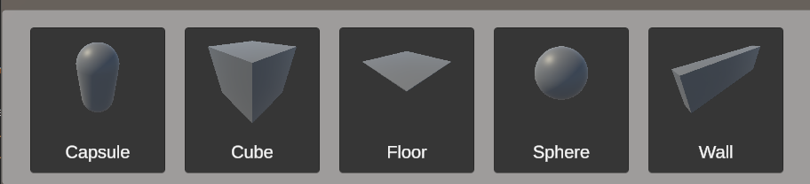

# Building System

## Notable Scripts
- [BuildingManager](../../Assets/Scripts/Building/BuildingManager.cs)
- [GhostPlacerAndSnapper](../../Assets/Scripts/Building/GhostPlacerAndSnapper.cs)
- [GenerateSnappingPoints](../../Assets/Scripts/Building/Snapping/GenerateSnappingPoints.cs)
- [PlacedObject](../../Assets/Scripts/Objects/PlacedObject.cs)
- [PlaceObjectsUI](../../Assets/Scripts/UI/PlaceObjectsUI.cs)

The building system starts when the player enters build mode and goes to place some objects. They'll be greeted by the following UI:

The UI for every object is automatically generated, their name is simply their prefab name. We do also however generate an Image of each prefab akin the the look it has in Unity's own content browser.
This way there is no need to manually generate images for every object and would allow extra assets to be loaded in during runtime. 

When a building is selected, a ghost of that object spawns in. Each ghost contains some snapping points, but more on that later.
 
A ghost can be placed when a desired position has been achieved and the ghost object will change into a normal object. This object also has snapping points.

### Snapping points
As soon as at least a singular object has been placed, snapping points are functional. Snapping points are used to snap objects to one another.
In the following GIF, snapping points are represented by spheres.
 
 
Snapping points are generated using the bounds of each mesh, defined by it's renderer component. 
We use these bounds to generate 6 snapping points, each representing the center of a face of an imaginary cube around the object. 

 
When a ghost object comes near an object with snapping points, it goes through the following steps, each of which can be found in GhostPlacerAndSnapper.cs:
 

1. Find the nearest object, this will be the object we're attempting to snap to.
2. Find the snapping point of this object that is nearest to our snapping point. 
3. Find our snapping point nearest to the other objects snapping point from 2.
4. Set our gameobject position to that of the snapping point.
5. Offset the gameobject position with that of our own snapping point. 
